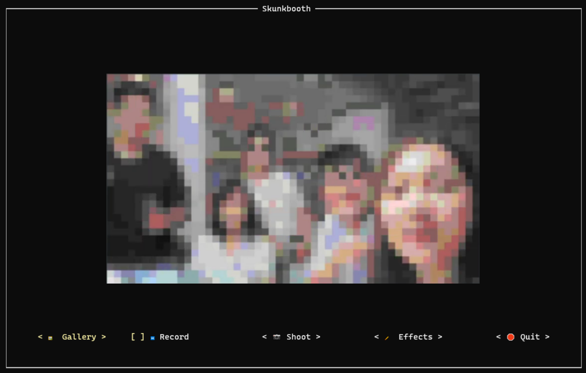
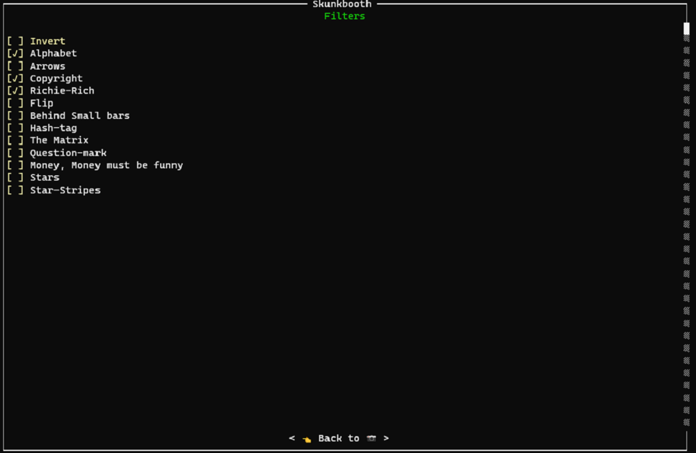
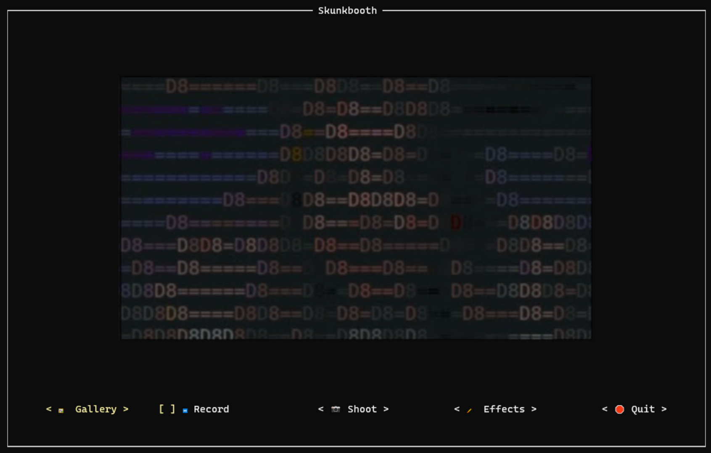
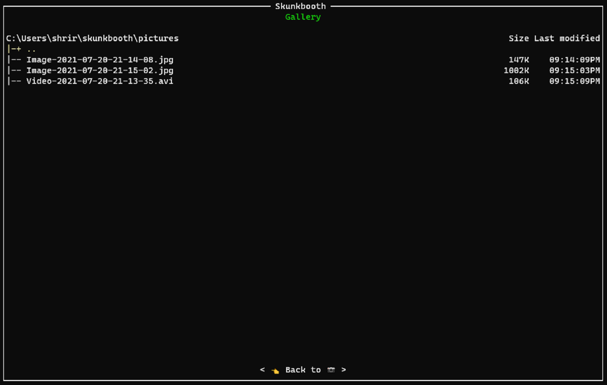
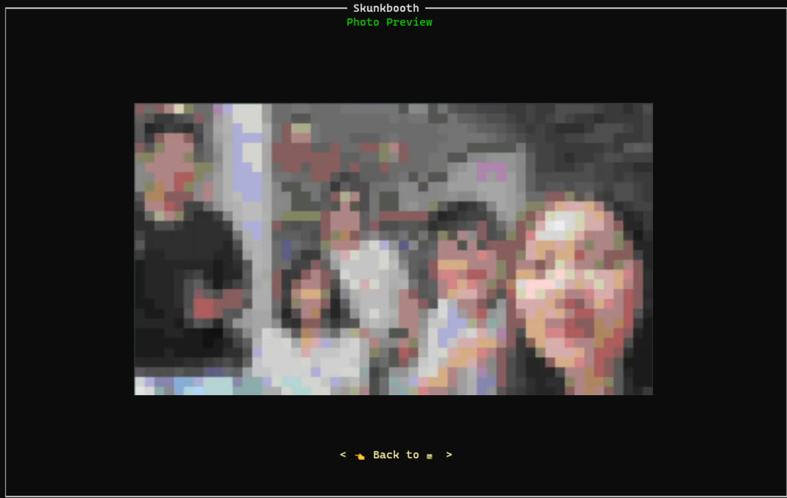

<!--  -->
<div align="center">
   
   <br/>
   <br/>
</div>

[](https://github.com/Davidy22/scholarlySkunkJam/issues) &nbsp;&nbsp; [](https://github.com/Davidy22/scholarlySkunkJam/network) &nbsp;&nbsp; [](https://github.com/Davidy22/scholarlySkunkJam/stargazers)&nbsp;&nbsp; [](https://pypi.org/project/skunkbooth/) &nbsp;&nbsp; [](https://www.google.com/url?sa=t&rct=j&q=&esrc=s&source=web&cd=&cad=rja&uact=8&ved=2ahUKEwimlcXOwPHxAhXt4nMBHR1LDBUQFjAAegQICxAD&url=https%3A%2F%2Fwww.python.org%2F&usg=AOvVaw0QREvGsjwHKp2GtoYvs1JH)

- [Skunkbooth](#skunkbooth)
  - [Why](#why)
  - [See it in action](#see-it-in-action)
- [Usage](#usage)
  - [Installation](#installation)
  - [Run](#run)
  - [Media location](#media-location)
- [Contributing](#contributing)
  - [Install Poetry](#install-poetry)
  - [Clone the repo](#clone-the-repo)
  - [Activate poetry shell](#activate-poetry-shell)
  - [Install dev deps](#install-dev-deps)
  - [Run the application](#run-the-application)
  - [Logs](#logs)
- [App Walkthrough](#app-walkthrough)
  - [Home](#-home)
  - [Shoot](#-shoot)
  - [Record](#-record)
  - [Effects](#-effects)
  - [Gallery](#-gallery)
  - [Preview](#-preview)
  - [Quit](#-quit)

# Skunkbooth

A camera app in terminal. One more reason to stay inside the box you call terminal.

### Why

With our revolutionary application, you don’t have to leave your terminal and climb a mountain,
just to get your next perfect Instagram picture.
Open terminal, run `skunkbooth` and capture funkiest images _inside_ the box (aka terminal).

We support all the modern operating systems. All you need is `python3`.

### See it in action

[](https://www.youtube.com/watch?v=47_HYQGqVIU)

# Usage

### Installation

```shell
pip install skunkbooth
```

### Run

After installation, use `skunkbooth` command to launch camera.

```shell
skunkbooth
```

### Media location

The photos and videos that you take are present in the following location

- MacOS and Linux

```shell
ls ~/skunkbooth/pictures
```

- Windows

```powershell
dir C:\Users\<username>\skunkbooth\pictures
```

# Contributing

[Poetry](https://python-poetry.org/) is used for package management.
For setting up your environment, follow along.

### Install Poetry

- MacOS, Linux or WSL

```shell
curl -sSL https://raw.githubusercontent.com/python-poetry/poetry/master/install-poetry.py | python -
```

- Windows Powershell

```shell
(Invoke-WebRequest -Uri https://raw.githubusercontent.com/python-poetry/poetry/master/install-poetry.py -UseBasicParsing).Content | python -
```

### Clone the repo

```shell
git clone https://github.com/Davidy22/scholarlySkunkJam.git
cd scholarlySkunkJam
```

### Activate poetry shell

```shell
poetry shell
```

### Install dev deps

```shell
poetry install
```

### Run the application

```shell
python3 -m skunkbooth.main
```

### Logs

Logs are located in `skunkbooth` folder.

- macOS and Linux

```shell
tail -f ~/skunkbooth/.logs/skunkbooth.log
```

- Windows (powershell)

```powershell
Get-Content C:\Users\<username>\skunkbooth\.logs\skunkbooth.log -Wait
```

# App Walkthrough

### 🏠 Home

Home screen is the first point of contact for the application. It displays the camera output in the screen by default,
when the application is started and enables access/navigation to all features of the application.

<div align="center">
   <br/>
   
   <br/>
   <br/>
</div>

### 📷 Shoot

Image(s) can be taken instantly by clicking on Shoot button in home screen.

### ⏯ Record

Record button in the home screen toggles video recording and it can be used to start and stop recording.

_Image and video files generated will be stored in [Media location](#media-location) as .jpg and .avi respectively._

### 🖌 Effects

The Effects screen features filters that can be applied to the camera output.

<div align="center">
   <br/>
   
   <br/>
   <br/>
</div>

To capture images and video by applying filters follow the below steps:

- Enable the checkbox associated with the desired filter(s).

- Navigate to the home screen using <👈 Back to 📷> button, which will now display the camera output
  post application of the selected filters.

- Use Shoot or Record options in the home screen as explained before.

Play around with multiple filters to capture some _grooviest_ images and videos.

<div align="center">
   <br/>
   
   <br/>
   <br/>
</div>

### 🖼 Gallery

Gallery screen is a file browser which displays list of images and videos captured using the application,
as shown in the image below.

<div align="center">
   <br/>
   
   <br/>
   <br/>
</div>

### 👁 Preview

Preview screen renders the media file that is opened via gallery screen. This screen currently
supports display of files only in .jpg format, with more formats to be added in the future versions.

<div align="center">
   <br/>
   
   <br/>
   <br/>
</div>

### 🛑 Quit

The application can be safely exited using Quit button in home screen.
